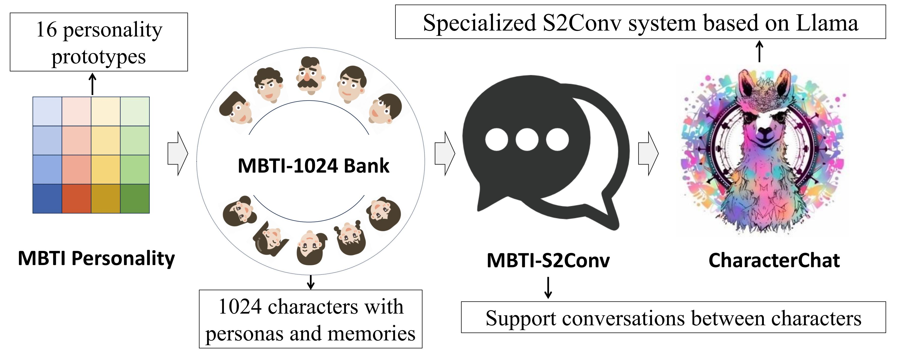

# Brief of Project
This repository is the source code of the paper *CharacterChat: Learning towards Conversational AI
with Personalized Social Support*

The main work of this repository includes two parts: (1) using well-designed prompt to get data from chatGPT and (2) using the data to fine-tune models.

# Getting Start
## chatGPT Data
In this part, you will get conversation records, role settings and other necessary information step by step from chatGPT. For this, we designed a pipeline. The code and data that need to be used in this pipeline are placed in the **src** and **data** folders respectively.
### OpenAI api
In order to use chatGPT, we called the interface of openai in the experiment. This means you better have several openai api keys (one is enough, but multiple can be faster). For details about the openai api key, please refer to the following link:
[https://platform.openai.com/docs/api-reference/introduction](https://platform.openai.com/docs/api-reference/introduction)

After you get api keys, please copy them to the **api_key.txt**. Each api_key occupies one line, separated by \n.
### Pipeline
**1. get profiles**
~~~python
bash src/gen_profile.sh
~~~
Through this operation, you can obtain the settings of multiple roles. You can modify the prompt in the **src/profile/make_data** to get more customized role settings.

**Input File: data/profile_input.json**

**Output File: data/profile_output.json**

**2. get profile transformed**
~~~python
bash src/gen_profile_trans.sh
~~~
After obtaining the character setting, further processing of the setting is required, such as obtaining second-person descriptions and obtaining additional information. Through this operation, a more complete role setting can be obtained.

**Input File: data/profile_output.json**

**Output File: data/profile_trans_output.json**

**3. get conversations**
~~~python
bash gen_dial.sh
~~~
Now, the conversation records between characters can be fetched. The default setting is that each character talks to 10 random characters. You can modify **src/dial/make_data.py** to change it. Also, because conversations consume a lot of tokens, we recommend testing in small amounts before getting large amounts of data.

**Input File: data/dial_input.json**

**Output File: data/dial_output.json**

**4. evaluate conversations**
~~~python
bash run_eval_dial.sh
~~~
After getting the conversations, we scored each conversation by 3 criteria. You can see **src/query_data.py** for details, and you can use custom evaluation criteria.

**Input File: data/eval_dial_input.json**

**Output File: data/eval_dial_output.json**

### Notice
Although there are many restrictions in the prompt, as a generative language model, chatGPT does not guarantee to return ideal results. Therefore, please clean the data after getting it to ensure that the data is correct, complete and can be parsed.

In addition, due to the large amount of data, only part of the data is provided in this repository as an example of the data format. If you want to get full data of our experiment, you can view this link.

[https://drive.google.com/drive/folders/15mBi-y08RL-GTKItIPAbAl13LV6SZzci?usp=drive_link](https://drive.google.com/drive/folders/15mBi-y08RL-GTKItIPAbAl13LV6SZzci?usp=drive_link)

## Model
After getting the dialogue data, we can train our model.

| Model             | Backbone              | Dataset                            |
|-------------------|-----------------------|------------------------------------|
| model_base        | LLaMA-2-7b            | model_base_dataset.json            |
| model_supporter   | LLaMA-2-7b            | model_supporter_dataset.json       |
| model_seeker      | LLaMA-2-7b            | model_seeker_dataset.json          |
| info_selecter     | BERT-base-uncased     | model_info_selecter_dataset.json   |
| persona_score     | BERT-base-uncased     | model_persona_score_dataset.json   |

### Backbone Models
Our model is mainly based on two models: LLaMA-2-7b and BERT-base-uncased. Therefore, first you need to download these two models.

1. [LLaMA-2-7b](https://huggingface.co/meta-llama/Llama-2-7b-hf)
2. [BERT-base-uncased](https://huggingface.co/bert-base-uncased)

After the download is complete, please put models in **model/models/**.

### Train Model
#### model_base
~~~python
bash model/train_model_base.sh
~~~
The training dataset for model_base includes [ESconv](https://github.com/thu-coai/Emotional-Support-Conversation) and [EmpatheticDialogues](https://github.com/facebookresearch/EmpatheticDialogues). model_base is the base model of model_supporter and model_seeker.

After training, merge the trained adapter and the base model to get the full model_base.
~~~python
python model/merge_lora.py model/models/Llama-2-7b-hf model/output/model_base model/models/model_base
~~~

#### model_supporter
~~~python
bash model/train_model_supporter.sh
~~~
The training dataset of model_supporter is processed conversation records from previous pipeline. It will talk with others like a supporter.

After training, merge the trained adapter and the base model to get the full model_supporter.
~~~python
python model/merge_lora.py model/models/model_base model/output/model_supporter model/models/model_supporter
~~~

#### model_seeker
~~~python
bash model/train_model_supporter.sh
~~~
Same as model_supporter, the training dataset of model_supporter is processed conversation records from previous pipeline. It will talk with others like a seeker.

After training, merge the trained adapter and the base model to get the full model_seeker.
~~~python
python model/merge_lora.py model/models/model_base model/output/model_seeker model/models/model_seeker
~~~

#### info_selecter
~~~python
bash model/train_model_info_selecter.sh
~~~
This model is used to select the currently used memory based on the conversation history. The training dataset for this model comes from conversation records. In each round of conversation, the selected memory is a positive sample, and the unselected memory is a negative sample.

#### persona_score
~~~python
bash model/train_model_persona_score.sh
~~~
This model was used to assess the degree of personality fit between the two parties in the conversation. The training dataset of this model comes from the conversation evaluation results, average score of the three scoring criteria is used as matching score.

### Notice
The above datasets and models are not included in this repository, you can download our datasets and models through links below.

**DATASET**

[https://drive.google.com/drive/folders/1n5UlZ4vm3bSBZv6c4kIvIQJHFrSZgON3?usp=drive_link](https://drive.google.com/drive/folders/1n5UlZ4vm3bSBZv6c4kIvIQJHFrSZgON3?usp=drive_link)

**MODEL**

[https://drive.google.com/drive/folders/1We80A24Cpz2WPd4hPKA2Mv8Ac4hop9nC?usp=drive_link](https://drive.google.com/drive/folders/1We80A24Cpz2WPd4hPKA2Mv8Ac4hop9nC?usp=drive_link)
[https://drive.google.com/drive/folders/1gCXbmFUS0f6SnhWGmU-Y5Bt4l3AcR390?usp=drive_link](https://drive.google.com/drive/folders/1gCXbmFUS0f6SnhWGmU-Y5Bt4l3AcR390?usp=drive_link)

## demo
### chat_demo
~~~python
bash model/run_chat_demo.sh
~~~
In this demo, you can chat with the model_supporter and model_seeker.

### web_supporter
~~~python
bash run_web_supporter.sh
~~~
A web page that allows you talk to model_supporter.
